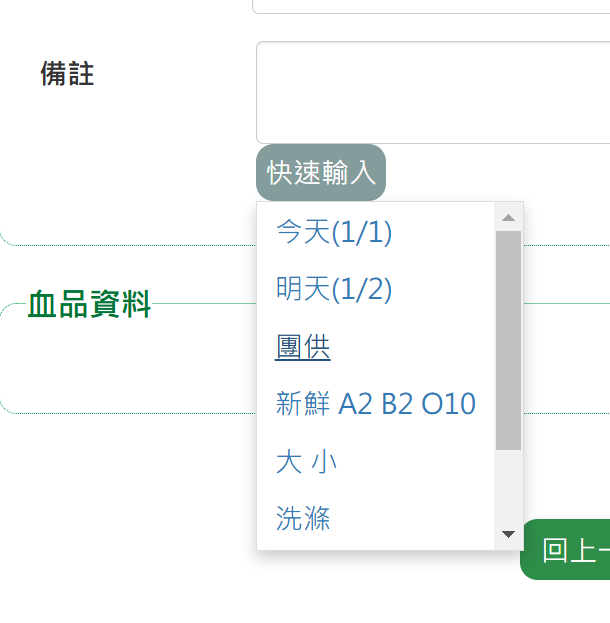

# 血庫小精靈 BloodOrderGenius
血液基金會[醫院網路作業平台](https://dh.blood.org.tw/hospital/)之 Chrome 擴充套件。

本擴充套件與血液基金會無關。

## 功能

### v1.1.0

**新增：**
- 部分血品申請頁面之備註欄位加入快速輸入選單

### v1.0.1

1. 儲存特殊血品申請紀錄：
   - 紅血球抗原陰性
   - HLA 配合血型
2. 批次確認領血訂單以及下載 EDI 檔。
3. 儲存醫事機構代碼，登入時自動代入。

## 安裝

### Chrome 線上應用程式商店

1.  進入[套件頁面](https://chrome.google.com/webstore/detail/%E8%A1%80%E5%BA%AB%E5%B0%8F%E7%B2%BE%E9%9D%88-blood-order-genius/fnpflpimngffoiecmnpkmechadbobjdj?hl=zh-TW)，點選「加到 Chrome」
2.  於彈出視窗選擇「新增擴充功能」

### 手動安裝

1. 下載專案源碼並解壓縮
2. 打開 Chrome 瀏覽器，進入擴充功能，啟用「開發人員模式」。
3. 載入未封裝項目，選擇專案之資料夾。
4. 點擊右上角套件圖示，啟動套件。

## 操作說明

- 在套件有作用的頁面，右上方會顯示「血庫小精靈工作中」。

	

- 「一般血品申請(表單試)」、「特殊血品申請」、「血品代發申請」頁面之備註欄位加入快速輸入選單。

	

- 醫院用血領血確認 > 點選「批次確認及下載EDI」> 輸入「供血單號」(可使用條碼機) 再點「加入」 >  再點下方「批次確認及下載EDI」> 首次使用，請同意「自動下載」。

  > 關閉 Chrome 瀏覽器之「下載每個檔案前先詢問儲存位置」，以獲得最佳體驗。

	

- 醫院特殊血品申請 > 新增 > 先「選擇病患」 > 選擇「特殊需求」 > 若選擇「血球抗原陰性」或「HLA 配合血型」，將會自動代入上次申請之資料。旁邊有註記上次申請時間。

	
	
- 開啟/關閉套件

	 
	
	
	
## 隱私權保護政策

1. 歡迎使用「血庫小精靈 BloodOrderGenius」Chrome 瀏覽器擴充套件(以下簡稱本套件)。特此向您說明本套件的隱私權保護政策。
2. 本套件僅於血液基金會「醫院網路作業平台」(https://dh.blood.org.tw/hospital/) 網站 (以下簡稱原網站) 作用。作用時於網頁右上方告知使用者。若不允許本套件，可至設定中關閉本套件，或將本套件移除。
3. 本套件會讀取、修改使用者瀏覽原網站之網頁及記錄使用者於原網站中輸入之資料。紀錄之資料儲存於 Chrome 瀏覽器之本地儲存空間 (Local storage)。本套件移除時，本套件所紀錄之資料亦會全部刪除。
4. 本套件所記錄之資料，僅會傳送給原網站，不會傳送給本套件之開發人員或其他第三方單位使用。
5. 傳送至原網站之資料，不適用本套件的隱私權保護政策，必須參考原網站中的隱私權保護政策。
